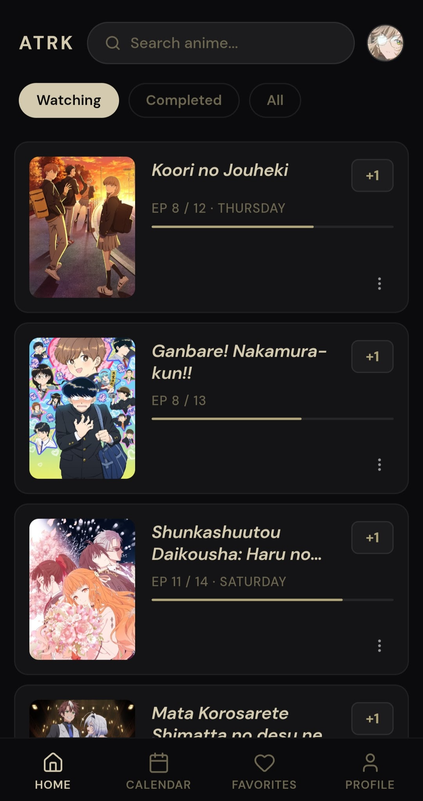
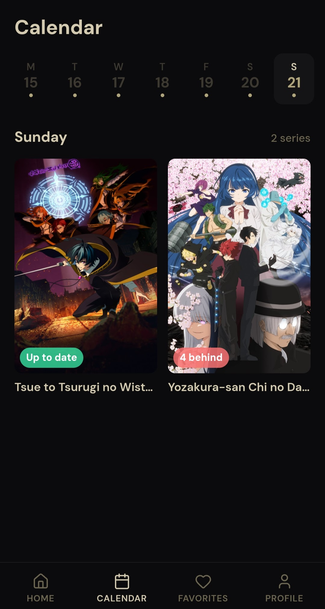
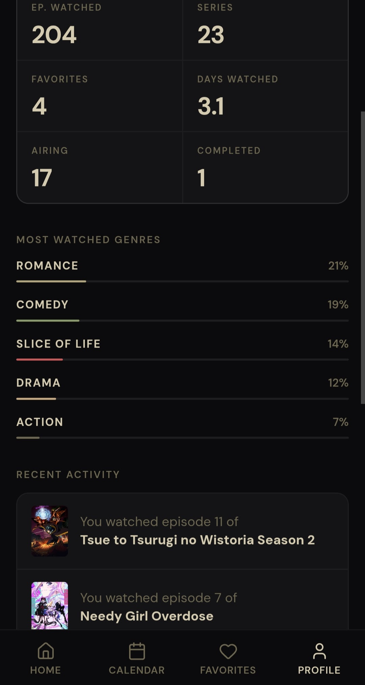

<div align="center">

# AniTracker

**A fast, no-friction anime tracker — log the episode you just watched with one tap.**

[**Live app → myanitracker.com**](https://myanitracker.com) · Free · Open source

[](LICENSE)

</div>

---

## Why I built this

I track my anime on AniList, and two things always bothered me:

1. **Too many taps to do the simplest thing.** To mark a single episode as watched I had to open the series page, find the progress control, and bump it — every time, for every show. All I wanted was a "+1".
2. **You can lie to yourself.** AniList happily lets you set your progress to episode 12 of a show that has only aired 5 episodes. That quietly breaks the whole point of tracking.

AniTracker is my answer to both. The home screen lists what you're watching, and each show has a single **+1** button. One tap, episode logged. And the button **won't let you go past the latest aired episode** — you can't mark what hasn't come out yet. Tracking that stays honest.

## Features

- **One-tap episode logging** — a `+1` button on every show on your home screen, capped at the latest aired episode.
- **Airing calendar** — a weekly view of when the next episode of each show you follow actually airs.
- **Favorites** — pin the shows you care about most.
- **Profile & stats** — episodes watched, estimated days watched, your top genres, and recent activity.
- **Year in review** — an annual recap of your watching (available every December).
- **Bilingual** — full English and Spanish UI.
- **Sign in with Google** or email.

## Screenshots

| Home (one-tap +1) | Airing calendar | Profile & stats |
| --- | --- | --- |
|  |  |  |

## Tech stack

**Frontend**
- Vue 3 (`<script setup>`) + TypeScript
- Vite
- vue-i18n (English / Spanish)
- Lucide icons

**Backend**
- Symfony 8 · PHP 8.4
- Doctrine ORM + PostgreSQL
- Symfony Security + Google OAuth2 login
- Fuzzy series search with PostgreSQL `pg_trgm` + `unaccent`
- S3-compatible object storage for profile images

**Data sources**
- [AniList](https://anilist.co) GraphQL API for series metadata and airing schedules

## Running locally

> Requires PHP 8.4, Composer, Node.js + [pnpm](https://pnpm.io), and PostgreSQL.

```bash
# Backend
cd backend
composer install
# Configure .env.local — at minimum: DATABASE_URL (PostgreSQL),
# Google OAuth credentials, and an S3-compatible storage endpoint.
php bin/console doctrine:migrations:migrate
symfony serve

# Frontend
cd frontend
pnpm install
pnpm dev
```

## Credits

AniTracker is a hobby project built on top of community APIs. Huge thanks to
[AniList](https://anilist.co) — this app wouldn't exist without the data they
make available.

## License

[MIT](LICENSE) © SueKano